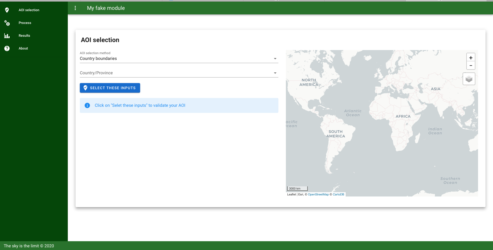

# sepal_ui
[](https://opensource.org/licenses/MIT)
[](https://travis-ci.org/12rambau/sepal_ui)

wrapper for ipyvuetify widgets to unify the display of voila dashboards in the sepal plateform.




## Installation 

the framework is available on Pypi:
```
$ pip install sepal_ui
```

The usage of this framework require that the earthengine api and it's authentification. Run:
```
$ earthengine authenticate
```
and follow the instructions

## Usage 

Click on the links to discover the different usage of the framework :
- Create an aoi selector [doc](./doc/aoi.md)
- Create an about section [doc](.doc.about.md)
- Link you process to a tile [doc](./doc/process.md)
- Create app framework with a title, a footer and a drawer menu [doc](./doc/app.md)


An example of app using this framwork can be found [here](https://github.com/12rambau/sepal_ui_template).

## suggested structure 

To use this framework it is highly recommanded to follow the following folder scructure:
```bash
├── app
│   ├── doc
│   │   ├── img
│   │   │   └── *.png 
│   │   │
│   │   └── *.md
│   │   
│   ├── scripts
│   │   └── you app process (*.py, *.cpp, *.r)
│   │
│   ├── [tile_name]_UI.ipynb
│   ├── UI.ipynb
│   │
│   └── ReadME.md
```

The `UI.ipynb` will be the entry point of you're app and it will call all the differents tiles created in the `[tile_name].ipynb` files.


For more specific and customized app. you can directly create your own component using the [ipyvuetify lib](https://github.com/mariobuikhuizen/ipyvuetify).

## Contribute 

If you want to contribute you can fork the project in you own repository and then use it. Please follow the [contributing guidelines](./CONTRIBUTE.md) if you consider working with us. 

To validate you modification go to the root folder of the package and run 
```py
python3 setup.py sdist
```

then make sure to uninstall the package from Pipy with 
```py
pip uninstall sepal_ui
```

and install instead the one from your local folder 
```py
pip install [your_sepal_ui_folder]
```
