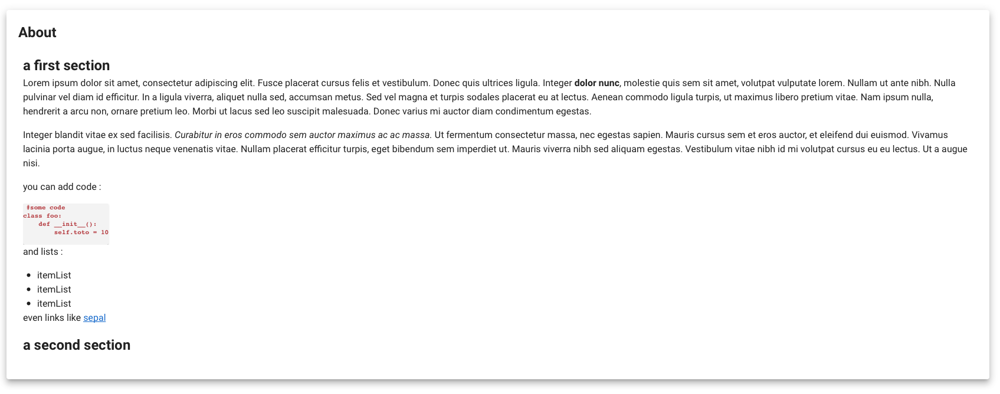

# Create an about section 

For you're application you'll may need a disclaimer or an about section to explain you're module to the end-user. 
It is long and unrelevant to write this section in plain html and import it to a Voila dashboard

using this framework you'll be able to create an about Tile by only writing an about file in the very simple [markdown format](https://www.markdownguide.org/cheat-sheet/).

## Code 

```py
from sepal_ui import widgetFactory as wf

#create the Html body of your about section 
pathname = 'utils/about.md' #path to your markdown file
fao_about = wf.TileAbout(pathname)

#will only be displayed if voila is launch from this tile
fao_about
```

The TileAbout function will take a .md file as an input, transform it into HTML plaint code and return a `ipyvuetify` Layout that can be displayed as a tile in a Voila notebook or in a `sepal_ui` app.

