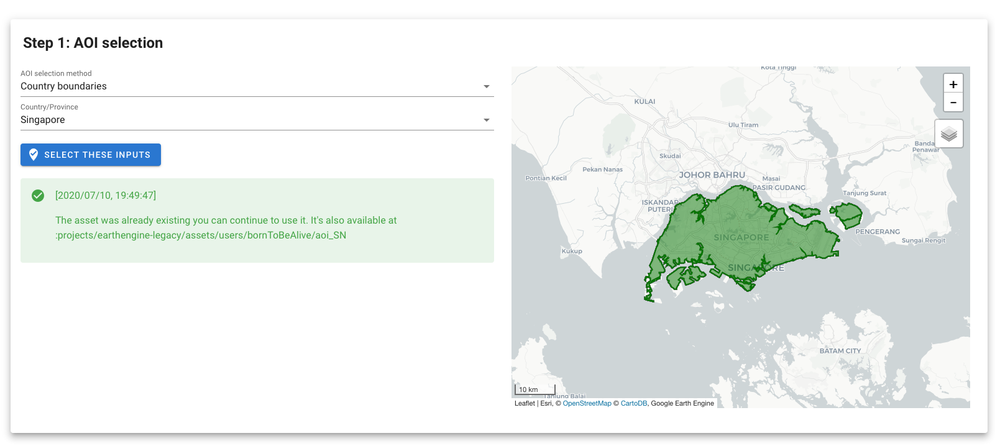
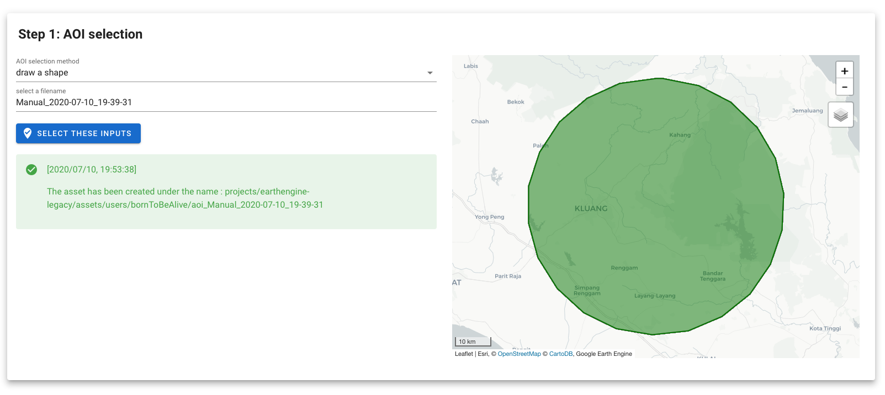
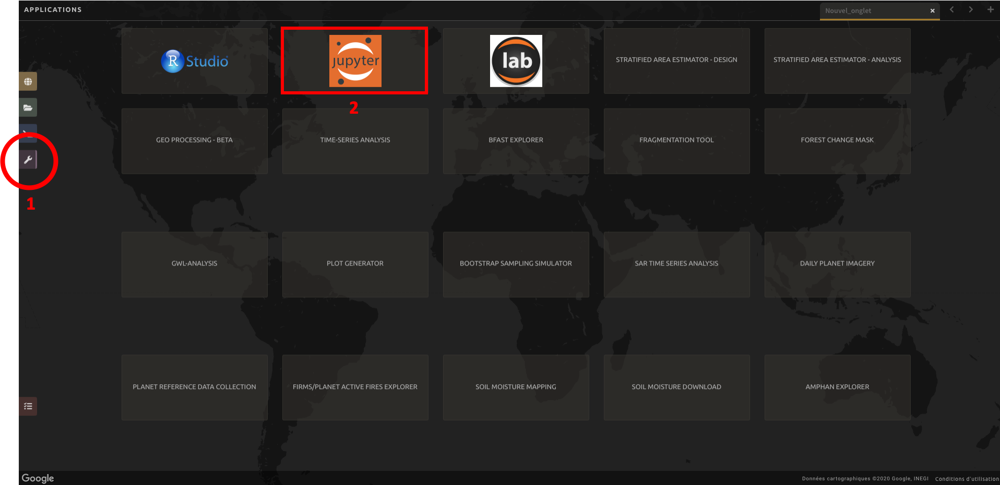
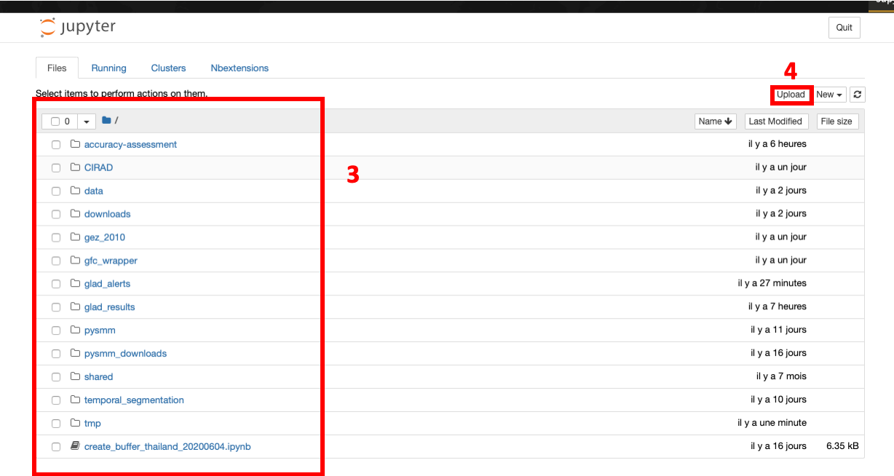
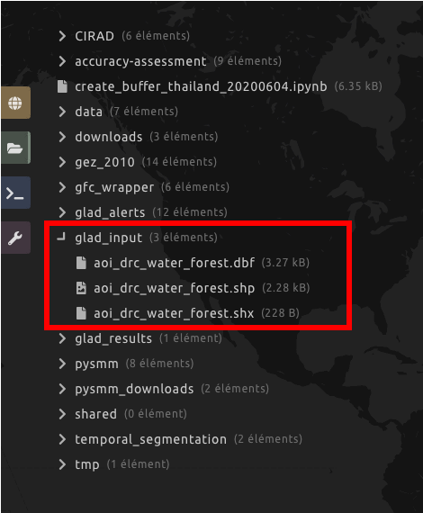
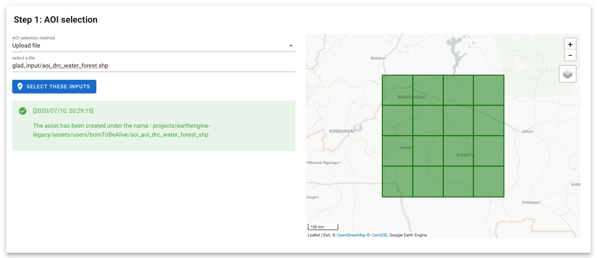
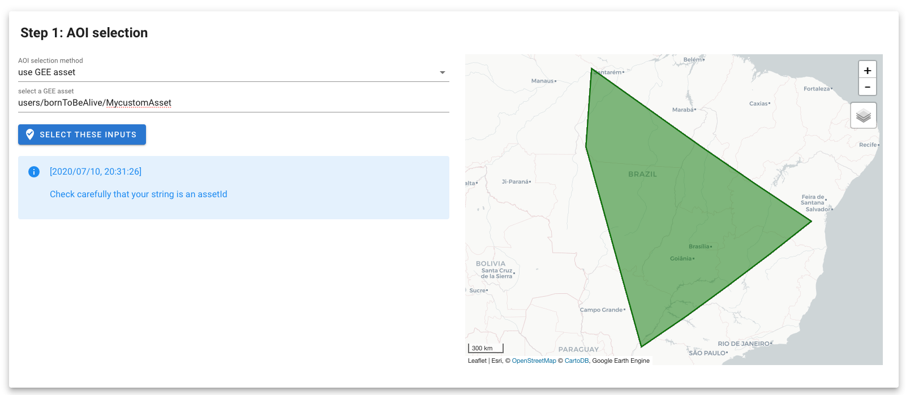

# Create aoi selector

The framework provides a stand alone aoi selector tile. It will create a aoi in you gee asset that will then be available for any process. 

## Code 

```py
from sepal_ui import widgetFactory as wf

#create the asset variable object 
aoi_IO = wf.Aoi_IO()

#create the tile 
fao_aoi = wf.TileAoi(aoi_IO)

#this tile will only be displayed if voila is launch from this notebook 
fao_aoi

```

In order to make the variable available for all the notebooks, they need to be nested in a IO class. The aoi_IO class provide all the necessary inputs for the aoi_tile to run and provide an output with assetID member. 

FYI 

```py
#create the aoi selectors IO
class Aoi_IO:
    def __init__(self):
        #set up aoi inputs
        self.file_input = None
        self.file_name = 'Manual_{0}'.format(datetime.now().strftime("%Y-%m-%d_%H-%M-%S"))
        self.country_selection = None
        self.selection_method = None
        self.drawn_feat = None
    
        #set up aoi output
        self.assetId = None
```

The TileAoi function return an `ipyvuetify` Layout that can be displayed as a tile in a Voila notebook or in a `sepal_ui` app.

## Usage 

On this initial tile, select the method you want to use to select your AOI. you can choose between four methods that are going to be explain in the followings.

## 1.1 Country boundaries
Once you reach the `country boundaries` value in the dropdown and select it, a new dropdown appears. 
There you can select a country name in the list provided. They correspond to every available country in the LSIB-2017 list. 

After validating your country, the map will zoom on the country you've validated and will create an aoi_[country_code] asset on your GEE account. It will be available for other projects.

> :warning: The output can select the wrong country, before validating your selection please verify in the blue alert that the `selected country` is the one you want to use. If wrong try to select it again.

 

## 1.2 Draw a shape

Once you have selected `draw a shape` in the dropdown, two new input will appear: 
 - Select a filename
 - The drawing tool on the map
 
 The filename will be the name of your AOI in your GEE drive and for the rest of the process. An auto-generated value is already set up by default. If you want to change it you can write anything in alphanumeric characters
 
 The drawing tool on the map allows you to draw shapes (rectangles, polygons and circle) 
 
 > :warning: Multiple geometries could lead to various bug or crash. If needed please consider running your analysis in two steps
 
After validating your shape, the map will zoom on the AOI you've validated and will create an aoi_[filename] asset on your GEE account. It will be available for other projects.



## 1.3 Import shapefile
Importing your own shapefile in this module will be perform in two steps. 
First you need to import the shape to your sepal folder and then use it. 

In a new application tab (1), select 'jupyter notebook' (2).


You should obtain a description of your local folder in Sepal (3). click on `upload` (4) and select the required files.


 

> :warning: in order to perform the construction of your AOI, the module will require you to upload .shp, .dbf and .shx with the same name in the same folder

> :question: It is strongly advised to put all your shapefile in a new folder such as `[process]_input`

Second step you can go back to your app module and select 'upload file' in the first dropdown menu.  
The dropdown will automatically include the available .shp files in your sepal folders. You'll may need to restart the app to update the list.



After validating your shape, the map will zoom on the AOI you've have validated and will create an aoi_[filename] asset on your GEE account. It will be available for other projects.

## 1.4 import GEE asset

Once you have selected `use GEE asset` in the dropdown, just enter the name (2) of your asset as it appears on your GEE account (1) 




After validating your AOI the map will zoom on the AOI you have validated

---
[ go to  &rarr; readme.md](../README.md)  
                                          


