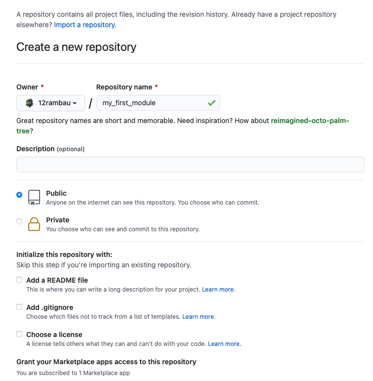
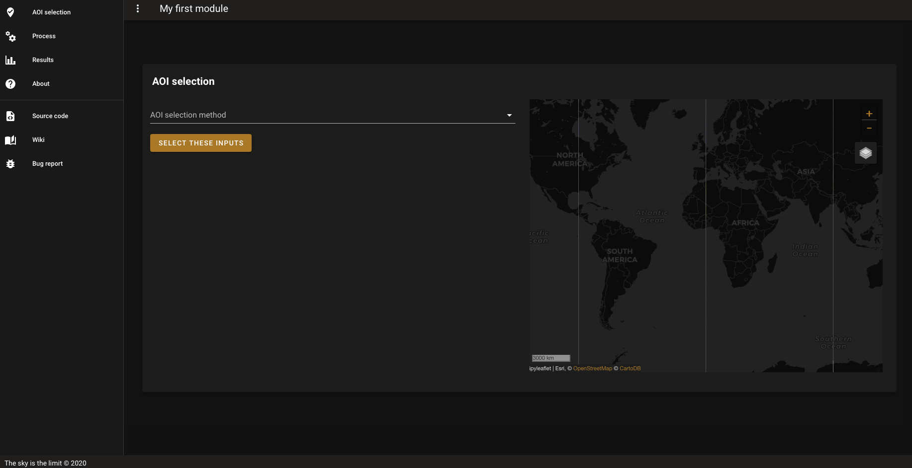

Create my first module
======================

In this tutorial we will show How to get a ready to use module skeleton and synchronize it with a github repository

Create the github repository 
----------------------------

To initialize our project, let's create an empty github repository.
Make sure that the repository is public.
All the following checkbox need to stay unchecked:

* add a README file 
* add a .gitignore
* choose a licence

.. note::
   
   As the repository is empty there is no need to fill the description, it will not be taken into account

Here I will use :code:`my_first_module`:

You can click on :code:`create repository`
Keep the GitHub webpage open.

Initialize the module 
---------------------

Open Sepal in a second tab of your browser and start an new instance (t1) in the terminal interface

from root execute the following command:

.. code-block:: bash
   
   module_factory.sh

It will launch the creation script of the module factory. 

.. code-block::

      
   ##################################
   #                                #
   #      SEPAL MODULE FACTORY      #
   #                                #
   ##################################

   Welcome in the module factory interface.
   This interface will help you building a dashboard app based on the sepal_ui librairy
   Please read the documentation of the librairy before launching this script

   Initializing module creation by setting up your module parameters
   ‾‾‾‾‾‾‾‾‾‾‾‾‾‾‾‾‾‾‾‾‾‾‾‾‾‾‾‾‾‾‾‾‾‾‾‾‾‾‾‾‾‾‾‾‾‾‾‾‾‾‾‾‾‾‾‾‾‾‾‾‾‾‾‾‾

   Provide a module name: 
   My first module 
   Provide the url of an empty github repository: 
   https://github.com/12rambau/my_first_module.git
   Provide a short description for your module(optional): 
   This is the first module of my life 

   Build the module init configuration
   ‾‾‾‾‾‾‾‾‾‾‾‾‾‾‾‾‾‾‾‾‾‾‾‾‾‾‾‾‾‾‾‾‾‾‾

   Cloning into '/home/prambaud/My_first_module'...
   remote: Enumerating objects: 177, done.
   remote: Counting objects: 100% (177/177), done.
   remote: Compressing objects: 100% (107/107), done.
   remote: Total 177 (delta 82), reused 149 (delta 60), pack-reused 0
   Receiving objects: 100% (177/177), 337.05 KiB | 275.00 KiB/s, done.
   Resolving deltas: 100% (82/82), done.
   Write a default README.md file
   Write a default ABOUT.md file
   Update the module name in the json translation dictionnaries
   Initialized empty Git repository in /home/prambaud/My_first_module/.git/
   [master (root-commit) 0519924] first commit
   25 files changed, 1115 insertions(+)
   create mode 100644 .gitignore
   create mode 100644 LICENSE
   create mode 100644 README.md
   create mode 100644 about_ui.ipynb
   create mode 100644 aoi_ui.ipynb
   create mode 100644 component/io/__init__.py
   create mode 100644 component/io/default_process_io.py
   create mode 100644 component/message/__init__.py
   create mode 100644 component/message/en.json
   create mode 100644 component/message/fr.json
   create mode 100644 component/message/test_translation.ipynb
   create mode 100644 component/parameter/__init__.py
   create mode 100644 component/parameter/default_directory.py
   create mode 100644 component/scripts/__init__.py
   create mode 100644 component/scripts/default_process.py
   create mode 100644 component/tile/__init__.py
   create mode 100644 component/tile/default_process_tile.py
   create mode 100644 component/tile/default_result_tile.py
   create mode 100644 component/widget/__init__.py
   create mode 100644 default_process_ui.ipynb
   create mode 100644 doc/fake_doc.md
   create mode 100644 doc/img/full_app.png
   create mode 100644 no_ui.ipynb
   create mode 100644 ui.ipynb
   create mode 100644 utils/ABOUT.md
   Counting objects: 37, done.
   Delta compression using up to 2 threads.
   Compressing objects: 100% (33/33), done.
   Writing objects: 100% (37/37), 140.42 KiB | 1.90 MiB/s, done.
   Total 37 (delta 8), reused 0 (delta 0)
   remote: Resolving deltas: 100% (8/8), done.
   To https://github.com/12rambau/my_first_module.git
   * [new branch]      master -> master
   Branch 'master' set up to track remote branch 'master' from 'origin'.

   WARNING: have a look to the git command executed in the process. if any of them is displaying an error, the final folder may not have been created
   If thats the case, delete the folder in your sepal instance (if there is any) and start the process again or contact us via github issues

   CONGRATULATION: You created a new module named: My first module
   You can find its code in /home/prambaud/My_first_module inside your sepal environment.
   To go further in the development of your application you can have a look at the sepalizing documentation.

   Let's code !

You need to answer 3 question :

Module name
^^^^^^^^^^^

Use the module name you want to use in the top bar of your application, special character are not forbidden.

github repository
^^^^^^^^^^^^^^^^^

You need to copy paste the link to the github repository that is still open in your second tab. Just click on the :code:`copy to clipboard` and paste it in the terminal.

If you're not sure it's here :

.. image:: ../../img/copy-repo-name.png

Description
^^^^^^^^^^^

You can provide a short description of your module. It will be added to the repository description and README. 
This parameter is optional

What happened ?
^^^^^^^^^^^^^^^

This script cloned the `template repository <https://github.com/12rambau/sepal_ui_template>`_ from GitHub into a folder that use your **module name** (it removed space and special characters). Then an new ABOUT.md and README.md file habeen build on the fly based on the description you gave in the questionnaire. 
The name of the app have been changed in the translation dictionnaries and your folder has been pushed to the empty Github repository.

if you reload your GitHub page in your browser, you'll find all that all the files have been uopdated and in your sepal terminal run :code:`cd my_first_repository` to start coding. 

Let's play
----------

In the app dashboard open Jupyter Notebook. From here open :code:`my_first_repository/ui.ipnb` notebook
On the top bar of your window click on the :code:`voila` button.

.. image:: ../../img/voila-btn.png

It will start a popup window. 

.. note::
   
   If you want to reproduce the sepal behaviour you'll need to add an extra option to the url of this popup windows. 
   The sepal interface will display voila with it's dark theme so if you don't want to have a light background add :code:`?voila-theme=dark` at the end of your url as in:
   
   .. code-block:: bash 
      
      https://sepal.io/api/sandbox/jupyter/voila/render/My_first_module/ui.ipynb?voila-theme=dark

The popup will display a fully functionnal app. A default process have been set-up to show you how the Python module can behave, take your time to play with it.

.. warning::

   If you're module start with an error, it means that your are not registered to your'e GEE account
   Follow the procedure to link you're GEE account to Sepal and then go to a fresh terminal

   .. code-block:: bash

      earthengine authenticate

   You'll need to follow the command instructions and then reload the dashboard. 
   
.. warning::

    The module factory is bound to a specific folder in sepal : :code:`module_results`. This folder stores the results of all dashboard applications. It is by default set in the :code:`directory.py` component : 
    
    .. code-block:: python 
        
        # component/parameter/directory.py
        
        from pathlib import Path
        
        module_dir = Path('~','module_results').expanduser()
        module_dir.mkdir(exist_ok=True)
        
    Please use it as a starting point for any results you xant to export in SEPAL.

      

