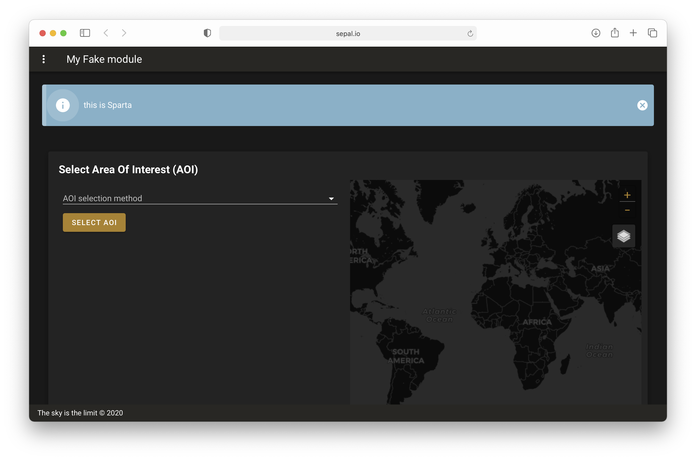
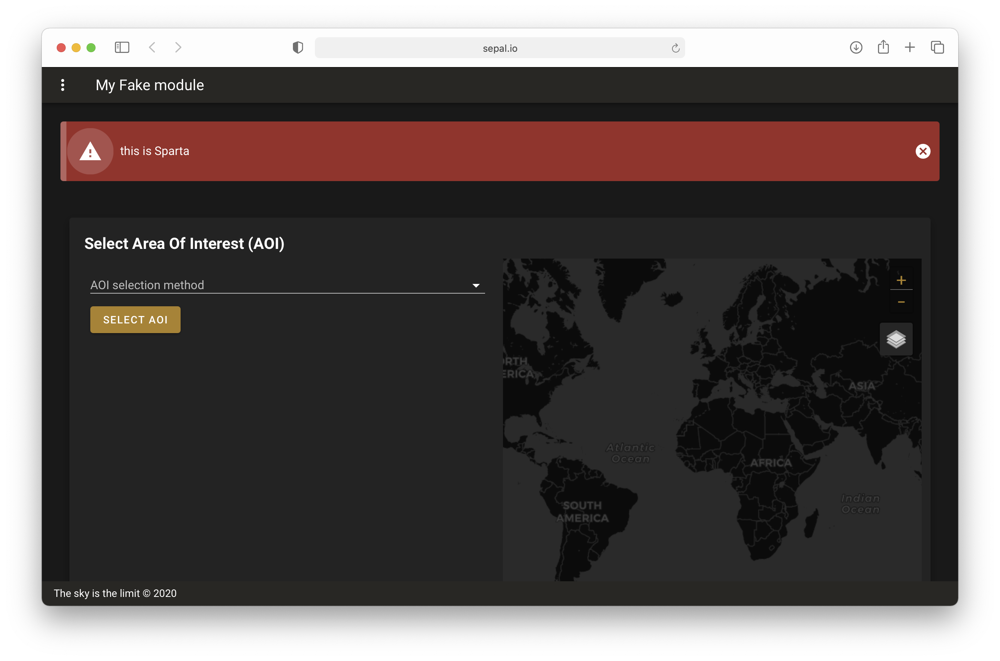

To go further
=============

In this section you will find some tips on how to maintain your application in the SEPAL ecosystem.

Interact with end user
----------------------

The End user doesn't know when a new version of the application is released or when a major issue is uncovered. To keep them engage with your application and make sure that it's not misused you must give them insight of what you are doing.

to do so use a banner to display information to the end user. In the :code:`ui.ipynb` file, you can modify the last cell as followed:

.. code-block:: python

    # ui.ipynb

    # create a message
    msg = "This is sparta"

    # display the app
    app.add_banner(msg)

which will be displayed in your app as in the next figure:

This alert is prominent and permanently display whatever the drawer item the user selects, forcing him to read your message. Once it is understood, the user can dismiss the banner clicking on the :guilabel:`x` button.

You can overwrite any arguments from the :code:`v.Alert` component, e.g if as persian army you are afraid of Sparta, you should display the banner as a danger:

.. code-block:: python

    # ui.ipynb

    # create a message
    msg = "This is sparta"

    # display the app
    app.add_banner(msg, type="error")

which will be displayed in your app as in the next figure:

.. note::

    More information on the :code:`add_banner` method can be found `here <../modules/sepal_ui.sepalwidgets.html?highlight=app#sepal_ui.sepalwidgets.app.App.add_banner>`__.

