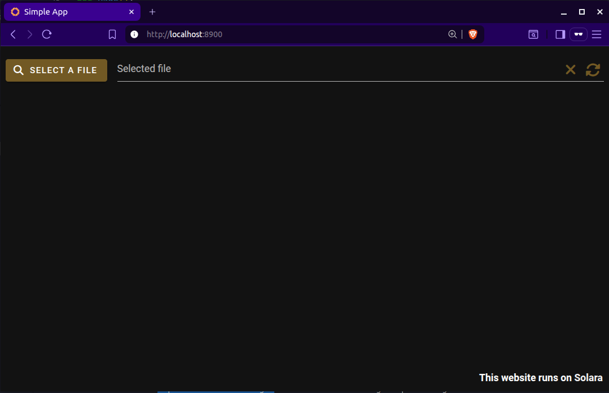
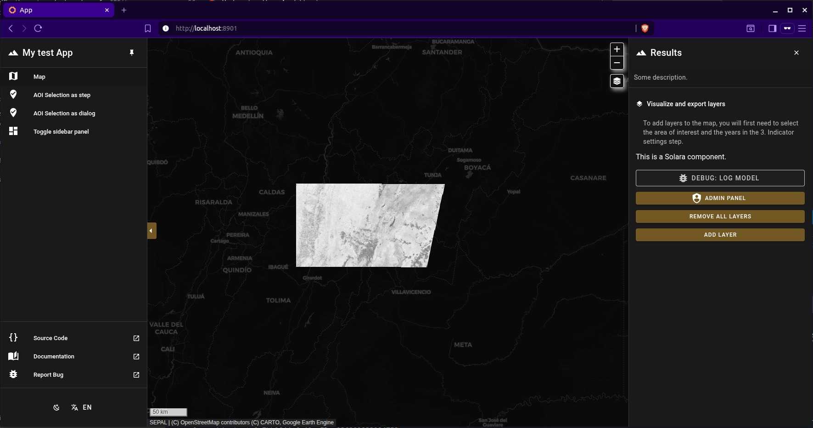
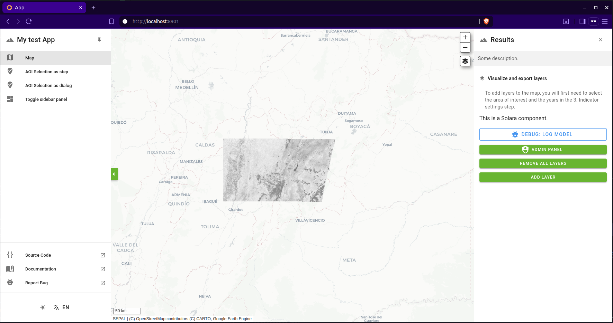

Creating PySepal apps with Solara
=================================

This tutorial guides you through creating PySepal web applications using the Solara framework. You'll learn how to build interactive geospatial applications that integrate with Google Earth Engine, SEPAL's file system, and how to deploy them in containers.

Overview
--------

`Solara <https://solara.dev>`_ is a reactive web framework for Python that enables you to build web applications using familiar Python components. When combined with SEPAL UI, it provides a powerful platform for creating geospatial applications with:

- Seamless Google Earth Engine integration (multi-user support)
- Access to SEPAL user files and storage
- Interactive mapping capabilities
- Containerized deployment

Prerequisites
-------------

Before starting, ensure you have:

- Python 3.10 or later
- Access to a SEPAL account and connection to Google Earth Engine
- Basic knowledge of Python and web development concepts
- Familiarity with Google Earth Engine

Development Environment Setup
-----------------------------

We strongly recommend developing PySepal applications on a **Linux system** for the best compatibility and performance. The following setup will ensure you have all the necessary tools and dependencies.

Setting Up Conda Environment
~~~~~~~~~~~~~~~~~~~~~~~~~~~~

First, create and activate a conda environment for your development:

.. code-block:: bash

    # Create a new conda environment with Python 3.10
    conda create -n pysepal_dev python=3.10 pip jupyter -y

    # Activate the environment
    conda activate pysepal_dev

Cloning and Installing SEPAL UI
~~~~~~~~~~~~~~~~~~~~~~~~~~~~~~~

Instead of installing directly from GitHub, we recommend cloning the repository first and installing in development mode. This allows you to explore the examples, modify the code, or contribute back:

.. code-block:: bash

    # Clone the sepal_ui repository (solara3 branch)
    git clone -b solara3 https://github.com/openforis/sepal_ui.git
    cd sepal_ui

    # Install in development mode (editable installation)
    pip install -e .

This development installation approach:

- Installs all necessary dependencies including Solara, ee-client, and SEPAL UI components
- Allows you to modify the library code and see changes immediately
- Provides access to examples, notebooks, and templates
- Enables you to contribute improvements back to the project

📚 Understanding Architecture
=============================

Building PySepal applications starts with internalizing that every line of your code executes in a shared, long‑lived server process that is simultaneously serving many users. There is no private desktop sandbox: multiple browser sessions will trigger the same Python module state, and any global singleton you create could accidentally leak context from one user to another.

To create PySepal applications, it's crucial to understand key concepts that enable multi-user, server-deployed applications. Applications deployed on the Solara server need to handle multiple users simultaneously, each with their own authentication and data access context.

Multi-User Challenges
---------------------

File System Access
~~~~~~~~~~~~~~~~~~

When building PySepal applications, you cannot use standard Python file operations like ``os.listdir()`` or ``pathlib``. If you did, your application would navigate the server's filesystem instead of the user's personal workspace.

The ``SepalClient`` solves this by authenticating with SEPAL's user-files API module. It makes HTTP requests to SEPAL's backend, which performs file operations within each user's isolated workspace. The API is familiar: ``list_files()`` to browse, ``get_file()`` to download, ``set_file()`` to upload, and ``get_remote_dir()`` to create directories. Each operation is authenticated with the user's SEPAL session ID, automatically handling path sanitization, MIME type detection, and creating a dedicated results directory for your module.

*To see the SepalClient in action, check the* `SEPAL Client notebook`_ *below.*

Google Earth Engine Integration
~~~~~~~~~~~~~~~~~~~~~~~~~~~~~~~

Multi-User Authentication
^^^^^^^^^^^^^^^^^^^^^^^^^

One of the main limitations of the `standard Earth Engine API <https://github.com/google/earthengine-api>`_ is its global authentication model. When a user calls ``ee.Initialize()``, all Python contexts on that server share the same authentication. In a multi-user environment, this means all users would share a single authentication per server.

To solve this, we use the `ee-client package <https://github.com/dfguerrerom/ee-client>`_, which allows us to create individual Earth Engine clients per user. The ee-client makes POST requests directly to Google Earth Engine and returns results specific to each user's authentication context.

GEEInterface Wrapper
^^^^^^^^^^^^^^^^^^^^

To bridge the gap between traditional Earth Engine development (single-user) and multi-user SEPAL applications, we created the ``GEEInterface`` wrapper. This wrapper provides a unified API that seamlessly handles both single-user and multi-user deployments, using ee-client internally for multi-user scenarios.

The advantage of ``GEEInterface`` lies in its dual-mode architecture. When developing locally, initialize it without any session parameter—it uses the standard ``ee`` module after ``ee.Initialize()``. When deployed to SEPAL with multiple users, pass an ``EESession`` or set ``use_sepal_headers=True`` to switch to the async ``ee-client`` flow, ensuring each user gets isolated credentials.

The interface maintains its own event loop thread to handle async Earth Engine operations while providing a synchronous API. When you call ``get_info()`` or ``get_map_id()``, it runs the async version in its event loop and blocks until complete. For async contexts, use the ``*_async`` variants directly. The interface includes safety checks to prevent deadlocks—if you call a blocking method from its own thread, it raises a clear error.

Common Operations
"""""""""""""""""

The ``GEEInterface`` supports all the essential Earth Engine operations you need for geospatial applications:

* **Value compute**: Use ``get_info()`` or ``get_info_async()`` to compute Earth Engine objects, whether they're images, feature collections, or geometries.
* **Map visualization**: Call ``get_map_id()`` to obtain map tile descriptors that you can use to display Earth Engine imagery in maps.
* **Export operations**: Launch exports of images or tables to Earth Engine assets or Google Drive, with full control over format, region, scale, and other parameters.
* **Task management**: Check whether a task is running with ``is_running()``, retrieve task details with ``get_task()``, and monitor long-running operations.
* **Progress tracking**: For operations that may take time, wrap them in ``create_task()`` to observe progress updates and surface real-time status information in your user interface.

Asynchronous vs Blocking Methods
"""""""""""""""""""""""""""""""""

* **Choose the right variant**: Use async methods (``*_async``) when in async code or orchestrating multiple concurrent calls. Use blocking methods for simpler, sequential operations that do not take too long.
* **One interface per session**: In multi-user apps, always create one ``GEEInterface`` per user session, you can use the session_manager_ helpers to do this automatically.
* **Watch for deadlock warnings**: If you get a deadlock warning, you're calling a blocking method from the interface's async thread—switch to the ``*_async`` method.

*To explore GEEInterface capabilities, check the* `GEE Interface notebook`_ *below.*

DriveInterface
~~~~~~~~~~~~~~

The ``DriveInterface`` works similarly but uses SEPAL's authentication for Google Drive access. Since there's no separate drive-client, all requests are made synchronously, but each user gets their own authenticated Drive interface using their individual SEPAL credentials.

*To explore DriveInterface capabilities, check the* `Drive Interface notebook`_ *below.*

.. _session_manager:

SessionManager: Multi-User Context Handler
~~~~~~~~~~~~~~~~~~~~~~~~~~~~~~~~~~~~~~~~~~

The ``SessionManager`` is a singleton class that stores sessions per user and is fundamental to the multi-user architecture. This component must be initialized in all Solara applications (as shown in the examples below) to properly set up the other services:

- Creates and manages individual sessions for each user
- Stores GEEInterface, SepalClient, and DriveInterface instances per user session
- Ensures proper isolation between users
- Handles session cleanup and lifecycle management

In the application examples below, you'll see how to initialize the SessionManager using the ``setup_sessions()`` function within the ``@solara.lab.on_kernel_start`` decorator.

Hands-On Learning
-----------------

Before building your own application, explore the provided notebooks and templates.

**Example Notebooks**

Start Jupyter Lab and run these notebooks from ``sepal_ui/notebooks``:

.. code-block:: bash

    cd sepal_ui/notebooks
    jupyter lab

.. _SEPAL Client notebook:

- Learn how to access user files stored in SEPAL's file system
- Understand authentication with SEPAL services
- See examples of file upload, download, and workspace management
- Essential for applications that need to read/write user data

**GEE Interface (02_gee_interface.ipynb)**

.. _GEE Interface notebook:

- Understand Google Earth Engine integration with proper session management
- Learn about synchronous and asynchronous Earth Engine operations
- See how to handle serialized Earth Engine objects
- Critical for any geospatial data processing applications

**Drive Interface (03_drive_interface.ipynb)**

.. _Drive Interface notebook:

- Explore Google Drive integration for file management
- Understand how to list, download, and manage files from Google Drive
- Important for applications that need cloud storage integration

.. important::
   Run these notebooks and experiment with the code before proceeding to build your own applications. The concepts demonstrated in these notebooks form the foundation of all PySepal applications.

Testing Solara Templates
~~~~~~~~~~~~~~~~~~~~~~~~~
Create a ``.env`` file in the ``sepal_ui`` root directory:

.. code-block:: properties

    # Development settings
    SOLARA_TEST=true
    LOCAL_SEPAL_USER=your_username
    LOCAL_SEPAL_PASSWORD=your_password
    SEPAL_HOST=sepal.io # or your custom SEPAL instance URL

The repository also includes ready-to-run Solara application templates:

.. code-block:: bash

    # Activate conda environment
    conda activate pysepal_dev

    # Navigate back to the main sepal_ui directory
    cd /path/to/sepal_ui

    # Make the run script executable
    chmod +x run_solara.sh

    # Test the basic file input example
    ./run_solara.sh sepal_ui/templates/solara/solara_map_app/simple_app.py --port 8900

    # Test the map application template
    ./run_solara.sh sepal_ui/templates/solara/solara_map_app/app.py --port 8901

The ``run_solara.sh`` script automatically:

- Loads environment variables from your ``.env`` file
- Sets up proper SEPAL authentication variables
- Configures Solara server settings
- Launches your application with the correct port configuration

.. note::
   Never commit your ``.env`` file with real credentials to version control. Use environment-specific configurations and secure credential management in production.

🚀 Building PySepal Applications
================================

Now that you understand the core concepts and have tested the examples, let's build your own applications.

Basic Application Structure
---------------------------

Here's the basic structure for a Solara-based SEPAL application:

.. code-block:: python

    # this code can be found at: sepal_ui/templates/solara/solara_map_app/simple_app.py

    from pathlib import Path
    import solara

    from sepal_ui.sepalwidgets.file_input import FileInput
    from sepal_ui.solara import (
        setup_sessions,
        with_sepal_sessions,
        get_current_gee_interface,
        get_current_sepal_client,
        setup_theme_colors,
        setup_solara_server,
    )

    # Initializes the Solara server with optional asset locations (can be .css or .js files)
    setup_solara_server(extra_asset_locations=[])

    # Sets up session management when the application starts
    @solara.lab.on_kernel_start
    def on_kernel_start():
        """Set up sessions management for Solara applications."""
        return setup_sessions()

    @solara.component
    # Decorator that provides SEPAL session context to the app
    @with_sepal_sessions(module_name="your_module_name")
    def Page():

        # Set up SEPAL theme colors
        setup_theme_colors()

        # Get SEPAL interfaces (they can be obtained from anywhere in your app)
        gee_interface = get_current_gee_interface()
        sepal_client = get_current_sepal_client()

        # Your application content here
        solara.Markdown("# Welcome to Your SEPAL Application")

        # Add your components
        FileInput.element(sepal_client=sepal_client)

To run the application, use the provided ``run_solara.sh`` script as shown in the previous section, providing the path to your application file. If everything is set up correctly, your application should launch in the browser and the file system should show the files from your SEPAL workspace.

Map-Based Applications
----------------------

For map based applications, SEPAL UI provides the MapApp component that creates a map-based interface.

Complete Map Application Example
~~~~~~~~~~~~~~~~~~~~~~~~~~~~~~~~

.. code-block:: python

    # this code can be found at: sepal_ui/templates/solara/solara_map_app/app.py

    import logging
    import ipyvuetify as v
    import solara
    import ee

    from sepal_ui.mapping import SepalMap
    from sepal_ui.sepalwidgets.vue_app import MapApp, ThemeToggle
    from sepal_ui.solara import (
        get_current_drive_interface,
        get_current_gee_interface,
        get_current_sepal_client,
        setup_sessions,
        setup_solara_server,
        setup_theme_colors,
        with_sepal_sessions,
    )
    from sepal_ui.solara.components.admin import AdminButton
    import sepal_ui.sepalwidgets as sw

    setup_solara_server()

    @solara.lab.on_kernel_start
    def on_kernel_start():
        return setup_sessions()

    @solara.component
    @with_sepal_sessions(module_name="your_map_module")
    def Page():
        setup_theme_colors()

        # Theme toggle for dark/light mode
        theme_toggle = ThemeToggle()

        # Get SEPAL interfaces
        gee_interface = get_current_gee_interface()
        sepal_client = get_current_sepal_client()

        # Create the main map
        map_ = SepalMap(gee_interface=gee_interface, fullscreen=True, theme_toggle=theme_toggle)
        map_.center = [4.75, -74.12]  # Set initial center

        # Create UI components for map interactions
        aoi_selector = v.Card(
            children=[
                v.CardTitle(children=["Area of Interest Selection"]),
                v.CardText(children=["Select your area of interest on the map."]),
                v.Btn(children=["Select AOI"], color="primary"),
            ]
        )

        # Define steps for the sidebar
        steps_data = [
            {
                "id": 1,
                "name": "AOI Selection",
                "icon": "mdi-map-marker-check",
                "display": "step",
                "content": aoi_selector,
            },
            {
                "id": 2,
                "name": "Processing Settings",
                "icon": "mdi-cog",
                "display": "step",
                "content": v.Card(children=[v.CardText(children=["Processing options here"])]),
            },
        ]

        # Configuration for the right panel
        right_panel_config = {
            "title": "Results",
            "icon": "mdi-image-filter-hdr",
            "width": 400,
            "description": "View and export your results.",
            "toggle_icon": "mdi-chart-line",
        }

        # Right panel content with controls
        right_panel_content = [
            {
                "title": "Layer Controls",
                "icon": "mdi-layers",
                "content": [
                    sw.TaskButton("Add Layer", small=True, block=True),
                    sw.Btn("Remove All", small=True, block=True),
                ],
            },
        ]

        # Create the complete map application
        MapApp.element(
            app_title="Your Map Application",
            app_icon="mdi-map",
            main_map=[map_],
            steps_data=steps_data,
            right_panel_config=right_panel_config,
            right_panel_content=right_panel_content,
            right_panel_open=True,
            theme_toggle=[theme_toggle],
            dialog_width=750,
        )

If everything is set up correctly, your map application should launch successfully. Here's what it looks like in both themes:

MapApp Component Features
~~~~~~~~~~~~~~~~~~~~~~~~~

The MapApp component provides:

- **Step-based Workflow**: Organize your UI into logical steps
- **Dialog Support**: Pop-up dialogs for detailed interactions
- **Right Panel**: Collapsible panel for results and controls
- **Theme Integration**: Automatic theme switching support

Containerization and Deployment
-------------------------------

SEPAL applications are deployed using Docker containers. Here's the complete deployment setup.

Docker Configuration
~~~~~~~~~~~~~~~~~~~~

**Dockerfile**:

.. code-block:: dockerfile

    FROM mambaorg/micromamba:latest

    LABEL org.opencontainers.image.source="https://github.com/sepal-contrib/your-app"

    WORKDIR /usr/local/lib/your_app

    USER root
    RUN apt-get update && apt-get install -y \
        nano curl neovim supervisor netcat-openbsd net-tools git \
        && apt-get clean \
        && rm -rf /var/lib/apt/lists/* \
        && rm -rf /tmp/* \
        && rm -rf /var/tmp/*

    COPY supervisord.conf /etc/supervisor/conf.d/supervisord.conf

    USER $MAMBA_USER

    COPY requirements.txt /home/$MAMBA_USER/requirements.txt
    RUN micromamba create -n your_app python=3.10 pip -c conda-forge -y && \
        micromamba activate your_app && \
        pip install -r /home/$MAMBA_USER/requirements.txt

    COPY . /usr/local/lib/your_app

    USER root
    RUN chown -R $MAMBA_USER:$MAMBA_USER /usr/local/lib/your_app

    USER $MAMBA_USER

    EXPOSE 8765

    CMD ["/usr/bin/supervisord", "-c", "/etc/supervisor/conf.d/supervisord.conf"]

**docker-compose.yml**:

.. code-block:: yaml

    services:
      your_app:
        build:
          dockerfile: ./Dockerfile
          args:
            - GIT_COMMIT=${GIT_COMMIT:-""}
        image: "your-org/your_app"
        container_name: your_app
        volumes:
          - "${EE_CREDENTIALS_PATH:-${HOME}/.config/earthengine/credentials}:/root/.config/earthengine/credentials"
        environment:
          SEPAL_HOST: "${SEPAL_HOST}"
          FORWARDED_ALLOW_IPS: "*"
          SOLARA_THEME_SHOW_BANNER: "False"
          SOLARA_TEST: "${SOLARA_TEST:-false}"
          LOCAL_SEPAL_USER: "${LOCAL_SEPAL_USER:-}"
          LOCAL_SEPAL_PASSWORD: "${LOCAL_SEPAL_PASSWORD:-}"
        healthcheck:
          test: ["CMD", "nc", "-z", "localhost", "8765"]
          timeout: 60s
          interval: 1s
          retries: 60
        networks:
          - sepal
        restart: always
        labels:
          org.opencontainers.image.source: https://github.com/your-org/your_app

    networks:
      sepal:
        external: true

Key Configuration Notes:

- **Port 8765**: Standard port for Solara applications in SEPAL. Ports must be unique per application and should be consecutive (8765, 8766, 8767, etc.)
- **Health Check**: Ensures the container is running properly
- **Environment Variables**: Configure SEPAL host and authentication
- **Network**: Uses external SEPAL network for communication

Application Registration
------------------------

Once your application is containerized, register it in SEPAL's application file `apps.json`.

Registering Your App in SEPAL
~~~~~~~~~~~~~~~~~~~~~~~~~~~~~

Add an entry to the ``apps.json`` file:

.. code-block:: json

    {
      "id": "your_app_id",
      "label": "Your Application Name",
      "path": "/api/app-launcher/your_app_id",
      "endpoint": "docker",
      "tags": ["ANALYSIS", "MAPPING"],
      "pinned": false,
      "googleAccountRequired": true,
      "logoRef": "sepal.png",
      "author": "Your Name/Organization",
      "description": "Detailed description of what your application does",
      "tagline": "Short tagline describing your app",
      "projectLink": "https://github.com/your-org/your-app",
      "repository": "https://github.com/your-org/your-app",
      "port": 8765,
      "branch": "main"
    }

Conclusion
----------

This tutorial covered the complete workflow for creating PySepal applications with Solara, from basic authentication to full deployment. The combination of SEPAL UI components, Solara's reactive framework, and proper containerization provides a powerful platform for building professional geospatial applications.

Key takeaways:

- Use SEPAL's session management system for authentication
- Leverage pre-built components for common functionality
- Structure your application with the MapApp component for map-based interfaces
- Use Docker for deployment
- Register your application properly in SEPAL's catalog

For more information and examples, refer to the SEPAL UI documentation and the example applications in the templates directory.

Happy coding!
