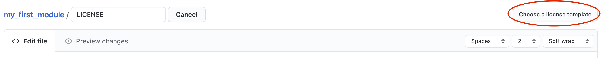

Structure of a module repository 
================================

In this tutorial we will explain how the files are structured in the module and how to use each module to buid an app 

If you just created you module you should have the following tree : 

.. code-block::

   ├── [app_name]
   |     |
   |     ├── component
   |     |     ├── io
   |     |     |     ├── __init__.py
   |     |     |     └── default_process_io.py
   |     |     |
   |     |     ├── message
   |     |     |     ├── __init__.py
   |     |     |     ├── en.json
   |     |     |     ├── fr.json
   |     |     |     └── test_translation.ipynb
   |     |     |
   |     |     ├── parameter
   |     |     |     ├── __init__.py 
   |     |     |     └── default_directory.py
   |     |     |
   |     |     ├── scripts 
   |     |     |     ├── __init__.py
   |     |     |     └── default_process.py
   |     |     |
   |     |     ├── tile 
   |     |     |     ├── __init__.py
   |     |     |     ├── default_process_tile.py
   |     |     |     └── default_result_tile.py 
   |     |     |
   |     |     └── widget
   |     |           └── __init__.py
   |     |
   |     ├── doc 
   |     |
   |     ├── utils
   |     |     └── ABOUT.md
   |     |
   |     ├── .gitignore
   |     ├── LICENCE
   |     ├── README.md
   |     |
   |     ├── about_ui.ipynb
   |     ├── aoi_ui.ipynb
   |     ├── default_process.ipynb
   |     |
   |     ├── no_ui.ipynb
   |     └── ui.ipynb

Project parameter files
-----------------------

licence
^^^^^^^

By default we use a `MIT <https://opensource.org/licenses/MIT>`_ licene as in all Sepal development. You'll need to customize this file to replace :

* the year
* your name/company name

If your project require a specific licence file you can edit this one to reflect what you need. I strongly suggest to edit this file directly in GitHub as the website provide a number of templates

If you use a custom licence, you'll nee to change the badge in the READM.md. 
copy paste any badge from this `github repository <https://gist.github.com/lukas-h/2a5d00690736b4c3a7ba>`_ instead of the classic MIT one : 

.. code-block::

   

.gitignore
^^^^^^^^^^

We use the default Python Github gitignore. It will prevent any cache file to be pushed in the github repository. 
If your module requires API keys, it is strongly suggested to add the :code:`api_key.txt` file inside the :code:`.gitignore` to avoid security breaches.

README.md
^^^^^^^^^

This file will e displayed in your GitHub front page. It's useful to provide instight to people about what your module is doing
it uses the markdown foramt. you can use the `offical cheatsheet <https://github.com/adam-p/markdown-here/wiki/Markdown-Here-Cheatsheet>`_ to help you refactor your README

utils
-----

You can add anything useful for your project in this folder (API code, workbench tools). at the moment it only host the ABOUT.md file. 

Partial ui
----------

* about_ui.ipynb
* aoi_ui.ipynb
* default_process.ipynb

these files are partial ui file. They will be used to create each step of ou app. more information in this tutorial

Final ui
--------

* no_ui.ipynb
* ui.ipynb

Thes files are gathering all the partial ui to create a fully fonctionnal app. The ui.ipynb file is dsigned to be display using voila when the no_ui.ipynb can be laucnh as a simple Python notebook.
More informations in this tutorial and this tutorial

component
---------

In this folder live all your app logic. Everything is well compartimented for the sake of maintenance. Python developer have alread recognize the :code:`__init__.py` file in each of it's folder wich means that every component is a package and can be used as such in any pythn file.

io
^^

In thi package every io object that will be used in the project are gathered. 

message
^^^^^^^

In this package all the messages that will be displayed in the app are gathered in json dictionnaries. More information in this tutorial

parameter 
^^^^^^^^^

For the sake of maintenance, hard-coded parameter shouldn't be used in the scripts or in the tiles. Instead they should be gathered in the parameter package. More information in this tutorial

scripts
^^^^^^^

This is where your app logic lives. More information in this tutorial.

tile
^^^^

This is where all the tiles that will be displayed in the app are created. More information in this tutorial 

.. note::

   In the :code:`sepal_ui` framework, app are designed using the tile-based UX. 
   A user interface that places icons in rows and columns with no space in between, exemplified by Windows Phone and Windows 8 Metro. we will refers to these unit as "tile" for the rest of the documentation

widget
^^^^^^

At some point you'll may encounter limitation in the basics `vuetify <https://vuetifyjs.com/en/>`_ components. every custom widget that you'll build need to live in this package. More information in this tutorial.
