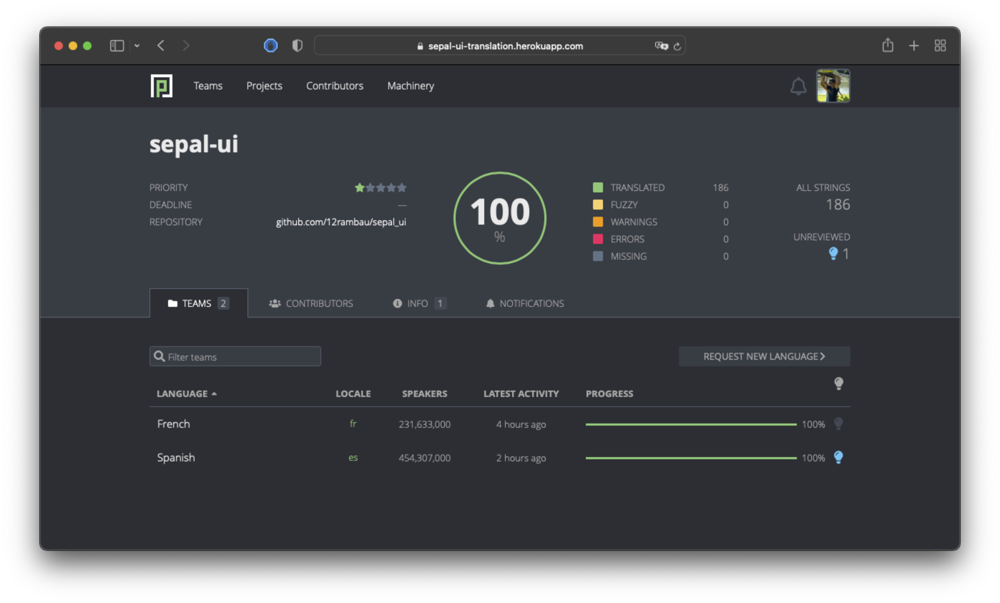

Translate my application 
========================

Sepal tries to be as inclusive as possible. To do so the platform is translated in these languages:

.. csv-table::

    English, Français, Español

To reflect the diversity of language available, :code:`sepal_ui` embed an translator tool and help you manage your messages for different languages. 

Update the main dictionary 
--------------------------

I assume that since you started using the lib you hard-coded in your files every single message displayed to the end user. 
The first thing you'll need to do is to update the main dictionary as it will be your reference for the rest of the app. 

If you removed every message relative to the default functions, your dictionary should look like the following : 

.. code-block:: python 

    # component/message/en/locale.json

    {
        "not_translated": "this message only exist in the en dict",
        "app": {
            "title": "My first module",
            "footer": "The sky is the limit \u00a9 {}",
            "drawer_item": {
                "aoi": "AOI selection",
                "about": "About"
            }
        }
    }

Add new message 
^^^^^^^^^^^^^^^

Here you gather and add every message you display in your app. 
For example if I want to display an error when :code:`no_aoi` is set i can add the following input in the dictionary: 

.. code-block:: python 

    # component/message/en/locale.json

    {
        "error": {
            "no_aoi":  "No AOI have been set, please provide one in step 1"
        }
    }

.. danger::

    remember that JSON format does only accept " (double quote)

and to call in any of your component you just need to import the ms Translator and use the names you gave as :code:`SimpleNameSpace`: 

.. code-block:: python 

    # component/tile.my_tile.py

    from component.message import ms

    print(ms.error.no_aoi)

Add message with parameter 
^^^^^^^^^^^^^^^^^^^^^^^^^^

If you want to keep the possibility to use parameter in your message you can use the :code:`.format()` method of Python string.  

.. note::

    The :code:`format()` method formats the specified value(s) and insert them inside the string's placeholder. The placeholder is defined using curly brackets: :code:`{}`. 
    Read more about the placeholders in the Placeholder `official documentation <https://docs.python.org/fr/3.5/library/string.html>`_. The :code:`format()` method returns the formatted string.

In our dictionary that could be use in the following way:

.. code-block:: python 

    # component/message/en/locale.json

    {
        "error": {
            "error_occured":  "The following error occured: {}"
        }
    }

and call it in your components for example in a try/Except statement : 

.. code-block:: python 

    # component/tile/my_tile.py

    try:
        # do stuff 
    except Exception as e:
        print(ms.error.error_occured.format(e))

Update the translated dictionaries
----------------------------------

.. note::

    If a key is missing in the target language dictionary, the :code:`Translator` object (:code:`ms`) will automatically fallback to the "en" key in order to avoid error or non displayed messages

Automatic
^^^^^^^^^

If your application is part of the OpenForis initiative and hosted on SEPAL, you can request to add your project to the **Pontoon** application list. Pontoon is an open-source translation solution that will deal with the trouble of creating the files and keep the keys updated. To learn more, please see their `documentation <https://mozilla-l10n.github.io/localizer-documentation/tools/pontoon/>`__. From the developer's side you'll need to add the folder corresponding to the language you want to support and open a request for a new project in our `issue tracker <https://github.com/12rambau/sepal_ui/issues/new/choose>`__.

.. note:: 

    The :code:`sepal-ui` keys for built-in components are managed on this application. 

    
.. important::

    Pontoon application doesn't support nested list in the :code:`.json` file and only provides support for named keys. If you really need to have a nested list in your :code:`.json` file, then you need to change your message key. Let's take the following file: 
    
.. code-block:: python 

    # component/message/en/locale.json

    {
        "paragraph": [
            "I'm a multline",
            "paragraph."
        ]
    }

Then you need to replace the list by a numbered dict using string integer as keys:

.. code-block:: python 

    # component/message/en/locale.json

    {
        "paragraph": {
            "0": "I'm a multline",
            "1": "paragraph."
        }
    }

This is compatible with pontoon and can be called in your file as follows:

.. code-block:: python

    # component/scripts/my_script.py

    from component.message import cm

    print(cm.paragraph[0])
    print(cm.paragraph[1])
    

Manual update
^^^^^^^^^^^^^

If this is the first time you translate your app, the easiest way is to simply copy/paste all the English dictionary (:code:`en/locale.json`) into the target one (:code:`fr/locale.json` or :code:`es/locale.json`) and replace all the message with their accurate translation. 

If it's not the first translation you make, you don't want to erase all you're already translated message. You only want to update the dictionary with the new key. 
To pinpoint the missing keys you can use your memory or one of the :code:`Translator` methods. 
Open the :code:`component/message/test_translation.ipynb` notebook. change the :code:`locale` variable into your target language. Then run all cells. The last one will display all the missing keys in the dictionary hierarchy.

.. code-block:: python 

    # component/message/test_translation.ipynb

    from pathlib import Path
    from sepal_ui.translator import Translator

    # select the language you want to test 
    locale = 'fr'

    # normally there is only one key lissing ('not_tranlated') in the default module
    # at the root of the file 
    print(ms.missing_keys())

    >>>>> root['not_translated']

Once your output message is "All messages are translated" it means that all the dictionaries have the same keys and the same shape. if someone open your application in another language the translated message will be used instead of the English one.

.. spelling:: 

    Español
