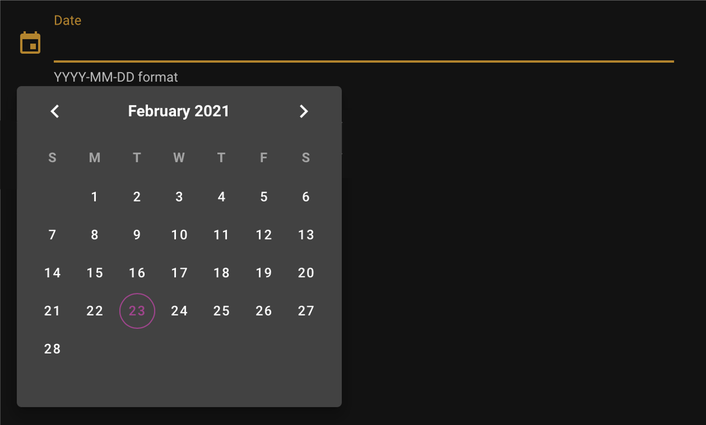

Date picker
===========

:code:`DatePicker` is a field widget to enter dates in the "YYY-MM-DD" format. it inherits from the :code:`SepalWidget` class.
Any argument from the original :code:`Layout` ipyvuetify class can be used to complement it.

.. code-block:: python 

    from sepal_ui import sepalwidgets as sw

    date = sw.DatePicker()

.. tip::

    You need to click outside of the slot to validate your selection

the value can be retreive from the :code:`v_model` trait. 

.. code-block:: python 

    # will return the value of the widget 
    date.v_model 

    # will be thown when v_model change
    date.observe(lambda change: print(change['new'])) 

    # bin the value to a io object using an Alert widget
    sw.Alert().bind(date, io, 'date_attr') 

.. note::

    More information can be found `here <../modules/sepal_ui.sepalwidgets.html#sepal_ui.sepalwidgets.inputs.DatePicker>`_.
