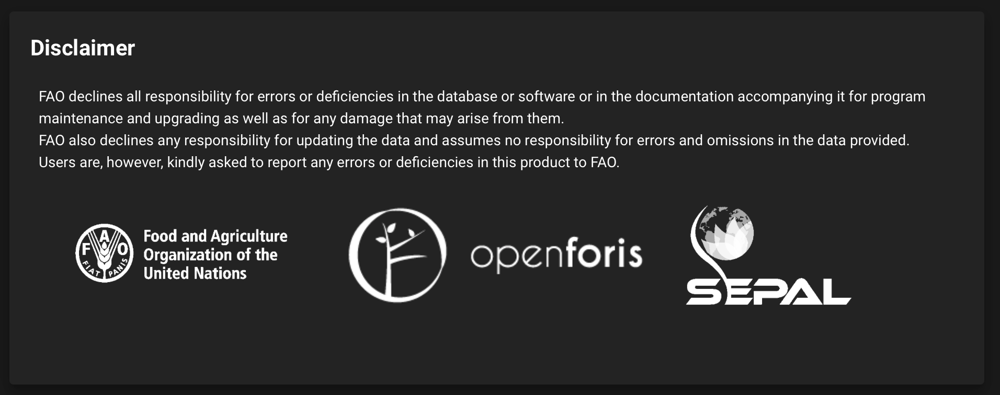

Disclaimer tile
===============

:code:`TileDisclaimer` is a :code:`TileAbout` using a the generic disclaimer .md file. This tile will have the “about_widget” id and “Disclaimer” title. it inherits from the :code:`TileAbout` class.

.. code-block:: python 

    from sepal_ui import sepalwidgets as sw
    
    disclaimer = sw.TileDisclaimer()
    disclaimer

.. note::

    More information can be found `here <../modules/sepal_ui.sepalwidgets.html#sepal_ui.sepalwidgets.tile.TileDisclaimer>`_.