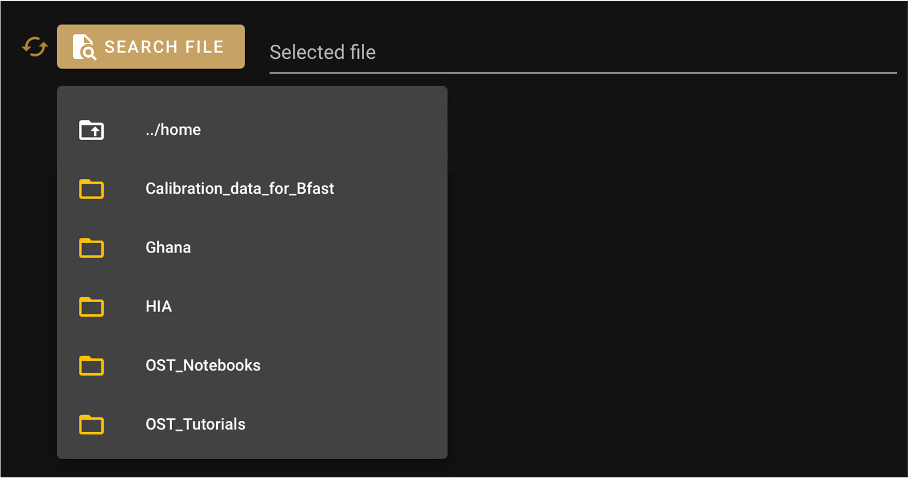

File input
==========

:code:`FileInput` is a field widget to search for files in the Sepal folders. it inherits from the :code:`SepalWidget` class.
Any argument from the original :code:`Layout` ipyvuetify class can be used to complement it.

.. code-block:: python 

    from sepal_ui import sepalwidgets as sw

    file_input = sw.FileInput()

the value can be retrieve from the :code:`v_model` trait. 

.. code-block:: python 

    # will return the value of the widget 
    file_input.v_model 

    # will be thown when v_model change
    file_input.observe(lambda change: print(change['new'])) 

    # bin the value to a io object using an Alert widget
    sw.Alert().bind(file_input, io, 'file_attr') 

.. note::

    More information can be found `here <../modules/sepal_ui.sepalwidgets.html#sepal_ui.sepalwidgets.inputs.FileInput>`_.