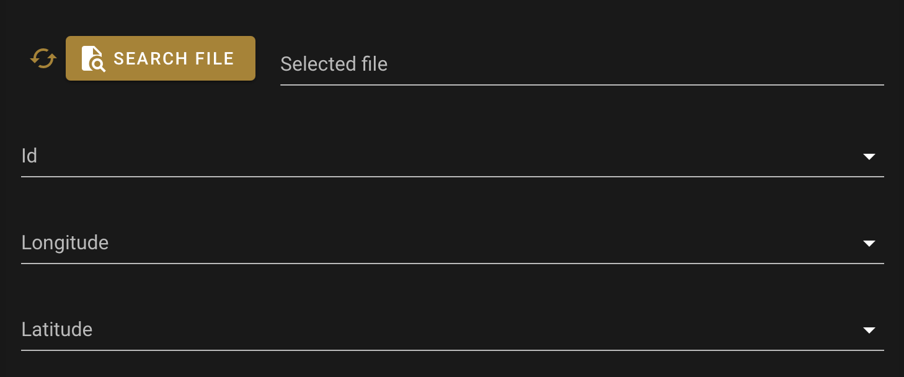

Load table
==========

:code:`LoadTableField` is a field widget to load points data. 
The user will provide a .csv or .txt file containing labeled dataset. 
The relevant columns (lat, long and id) can then be identified in the updated select. 
Once everything is set, the widget will populate itself with a json dict. {pathname, id_column, lat_column,lng_column}. 
It inherits from the :code:`SepalWidget` class.
Any argument from the original :code:`Layout` ipyvuetify class can be used to complement it.

.. code-block:: python 

    from sepal_ui import sepalwidgets as sw

    point_file = sw.LoadTableField()

the value can be retrieve from the :code:`v_model` trait. 

.. code-block:: python 

    # will return the value of the widget 
    point_file.v_model 

    # will be thown when v_model change
    point_file.observe(lambda change: print(change['new'])) 

    # bin the value to a io object using an Alert widget
    sw.Alert().bind(point_file, io, 'point_file_attr') 

.. warning::

    Remember that the v_model value will contain information to read the point file with :code:`geopandas` in the following format : {pathname, id_column, lat_column,lng_column}.
    No points are actually red by the widget.

.. note::

    More information can be found `here <../modules/sepal_ui.sepalwidgets.html#sepal_ui.sepalwidgets.inputs.LoadTableField>`__.

.. spelling::

    pathname
    lng