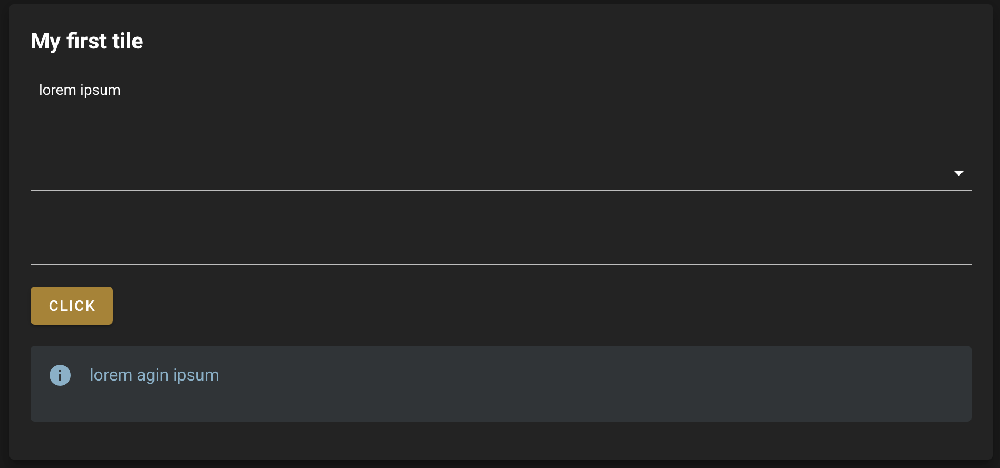

Tile
====

:code:`Tile` is a widget Layout. It's the core element of any sepal_ui app. It inherits from the :code:`SepalWidget` class.
Any argument from the original :code:`Card` ipyvuetify class can be used to complement it.

.. code-block:: python 

    from sepal_ui import sepalwidgets as sw
    import ipyvuetify as v 

    tile = sw.Tile(
        id_ = "tile",
        title = "My first tile",
        inputs = [sw.Markdown('lorem ipsum'), v.Select(), v.TextField()],
        output = sw.Alert().add_msg('lorem agin ipsum'),
        btn = sw.Btn()
    ) 
    tile

.. tip:: 

    The best way to use the tiles in an sepal_ui framework is to use :code:`Tile` as an abstract tile and build specific Tiles adapted to your need in the :code:`component/tile` package. 
    Everything is shown following this `tutorial <../tutorials/add-tile.html>`_.

.. note::

    More information can be found `here <../modules/sepal_ui.sepalwidgets.html#sepal_ui.sepalwidgets.tile.Tile>`__.