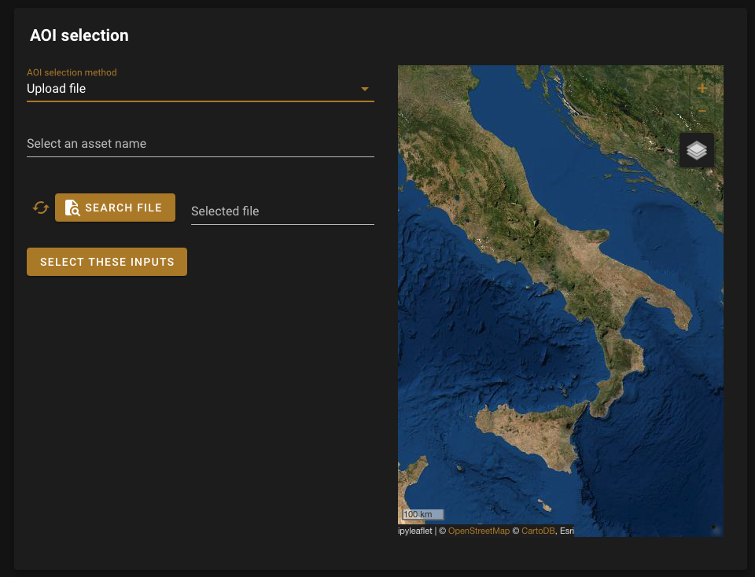

Tile AOI
========

:code:`TileAOI` is a :code:`Tile` tailored for the selection of an AOI. 
It is meant to be used with the :code:`aoi.Aoi_Io` object. 
Render and bind all the variable to create an autonomous AOI selector. 
If you use a custom AOI, it will create a asset in you gee account with the name :code:`aoi_[aoi_name]`.
It inherits from the :code:`SepalWidget` class. Any argument from the original :code:`Card` ipyvuetify class can be used to complement it.

.. code-block:: python 

    from sepal_ui import aoi
    
    aoi_io = aoi.Aoi_io()
    tile_aoi = aoi.TileAoi(aoi_io)

    tile_aoi

.. note::

    More information can be found `here <../modules/sepal_ui.sepalwidgets.html#sepal_ui.sepalwidgets.tile.Tile>`__.