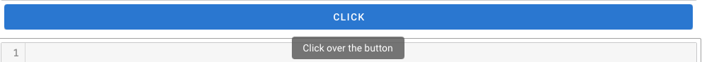

Tooltip
=======

:code:`Tooltip` is a custom widget to provide easy to use tooltip in the sepal_ui framework. We are based on the Vuetify web structure so the design of the tooltip design can be surprising for users coming from different platform. Here the tooltip is the main widget, and it owns the widget it describe. Here is an example for a :code:`Btn`.

.. code-block:: python

    from sepal_ui import sepalwidgets as sw 

    btn = sw.Btn('click')
    sw.Tooltip(widget=btn, tooltip='Click over the button')
    

.. note::

    More information can be found `here <../modules/sepal_ui.sepalwidgets.html#sepal_ui.sepalwidgets.sepalwidget.Tooltip>`_.